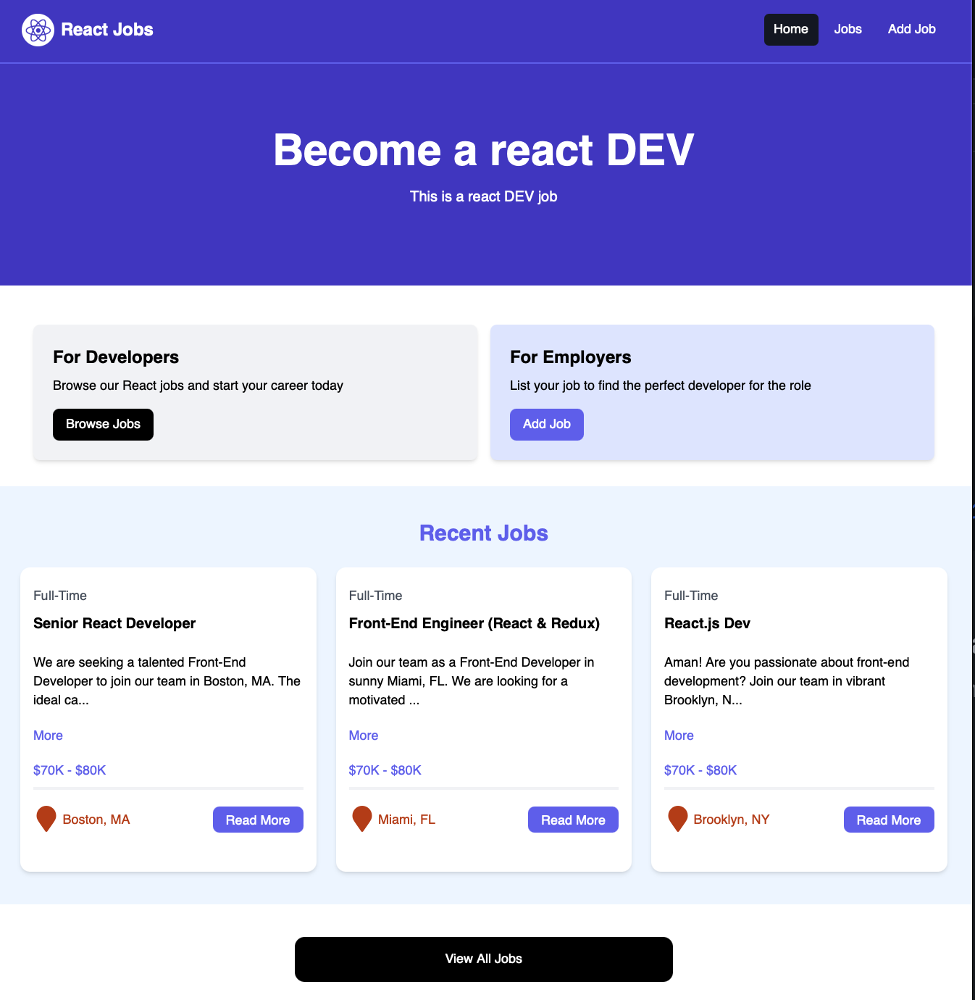
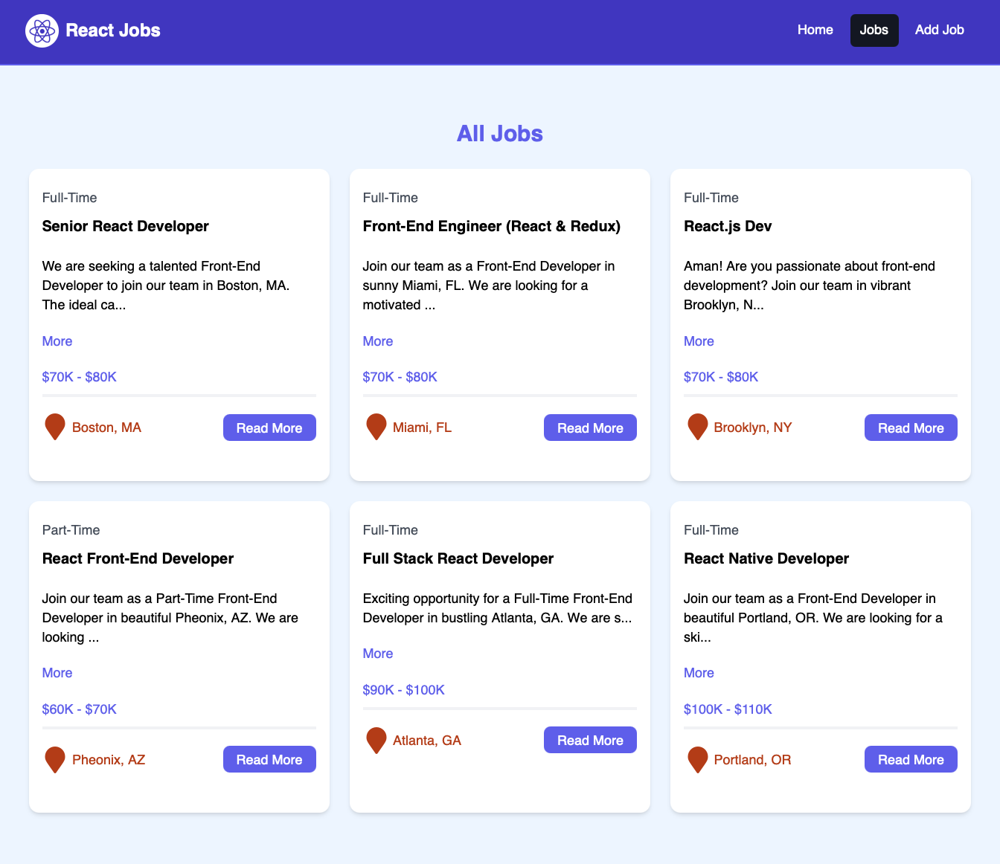
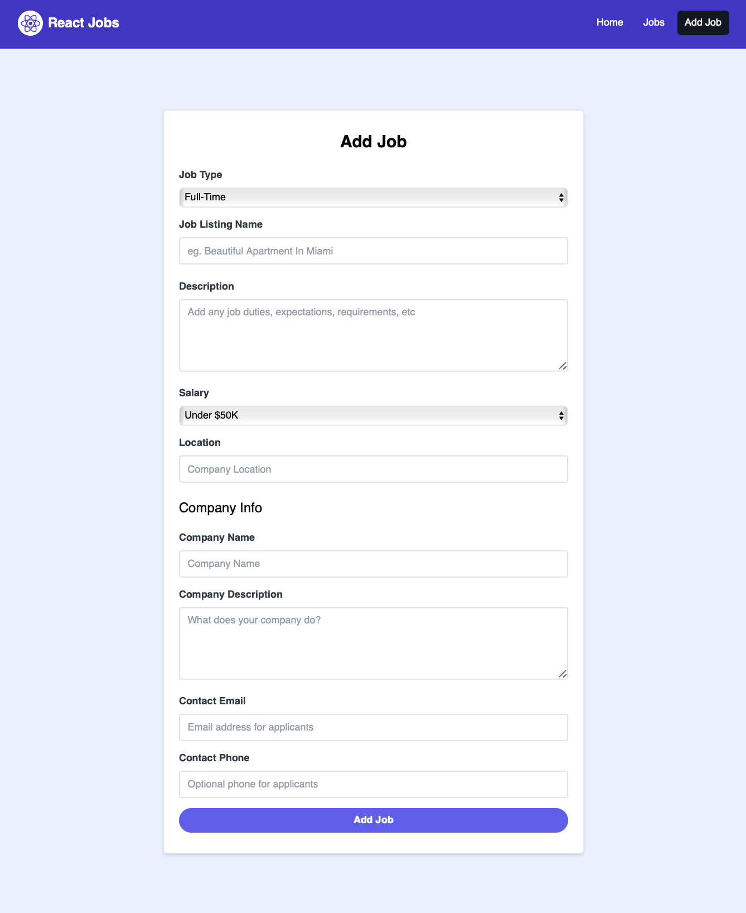
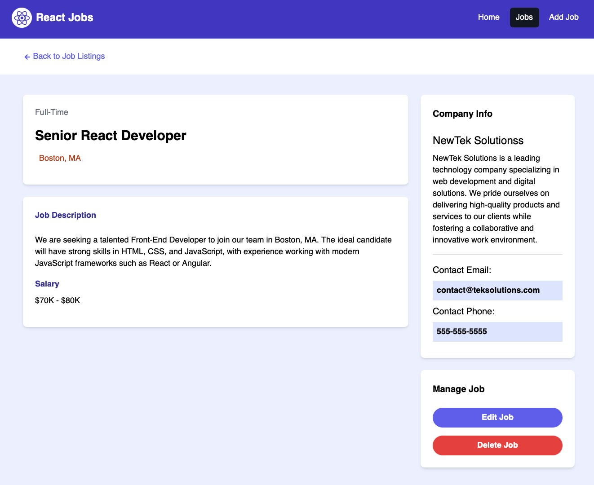

# React Courses

## Description
This project is a React application designed to showcase job listings and allow users to view and apply for jobs. It features a user-friendly interface and is built using modern web technologies.

## Features
- Job listings with detailed views
- User-friendly navigation
- Responsive design
- Tailwind CSS for styling

## Project Images
Here are some images showcasing the project:

### Landing Page


### All Courses


### Create Course


### Edit/Delete


## Installation Instructions
1. Clone the repository:
   ```bash
   git clone https://github.com/Aman149/react-courses.git
   ```
2. Navigate to the project directory:
   ```bash
   cd react-courses
   ```
3. Install the dependencies:
   ```bash
   npm install
   ```
4. Start the JSON Server:
   ```bash
   json-server --watch src/jobs.json
   ```
5. Start the React application:
   ```bash
   npm run dev
   ```
- Tailwind CSS for styling
- JSON Server for backend with `jobs.json` for job listings


## Installation Instructions
1. Clone the repository:
   ```bash
   git clone https://github.com/yourusername/react-courses.git
   ```
2. Navigate to the project directory:
   ```bash
   cd react-courses
   ```
3. Install the dependencies:
   ```bash
   npm install
   ```

## Usage
To start the development server, run:
```bash
npm run dev
```
Then open your browser and navigate to `http://localhost:3000` to view the application.

## Contributing
Contributions are welcome! Please open an issue or submit a pull request for any improvements or bug fixes.

## License
This project is licensed under the MIT License.
